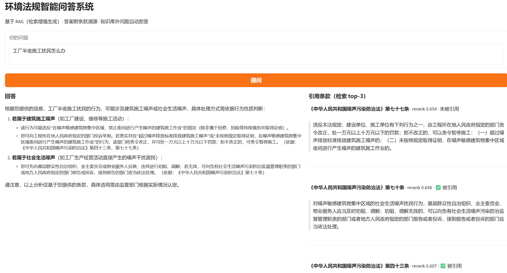
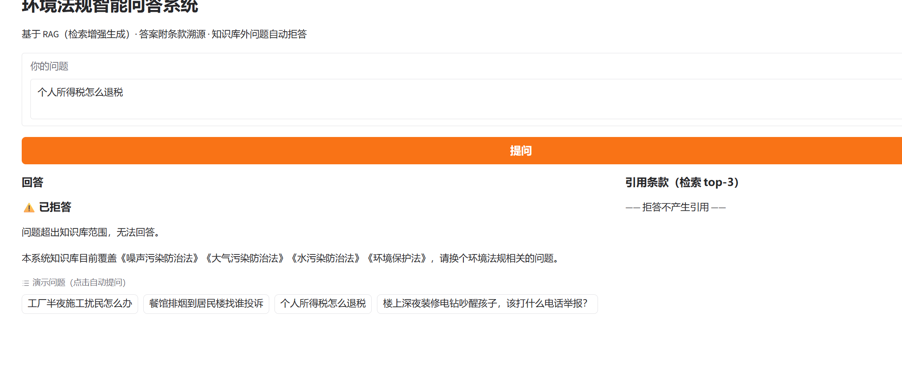
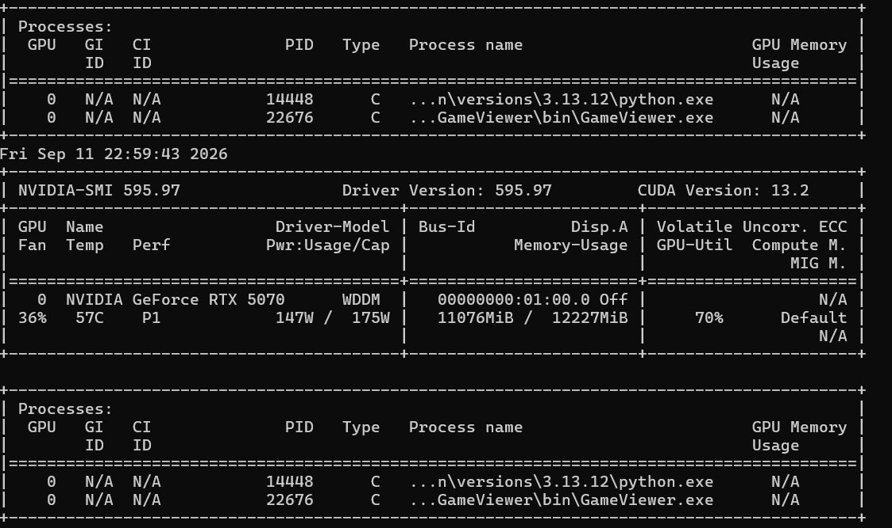
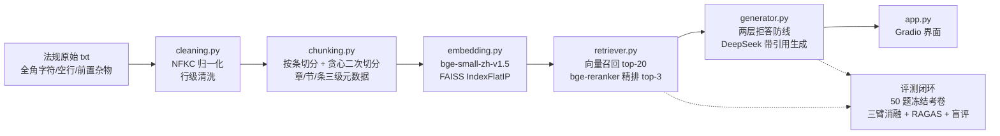

# EnvLaw-RAG：环境法规智能问答系统

一个覆盖 **RAG 全流程 + LoRA 微调 + 评测闭环** 的中文法规问答系统：从 4 部环境法规原文出发，完成清洗、结构化分块、向量检索、重排、带引用生成，并用三臂消融实验 + RAGAS + 人工盲评量化每一档的效果差异。

> 个人学习项目，2026.6 — 2026.9。目标是用完整、可复现的评测数据回答一个问题：**RAG 和 LoRA 各自带来了什么？**

## 演示

| 带引用回答 | 正确拒答 |
|---|---|
|  |  |



## 系统架构



## 核心结果（50 题条款级冻结考卷）

| 实验臂 | 检索命中@3 | 条款引用正确 | 幻觉引用次数 | 拒答准确率 |
|---|---|---|---|---|
| A. 纯 DeepSeek API | — | 28% | 19 | 90%（高误拒） |
| B. RAG | **92.5%** | 45% | 25 | 90% |
| C. RAG + LoRA 微调 | 92.5% | **75%** | **11** | 见下文迭代 |

**评测闭环的一次真实迭代**：C 臂初版漏拒 9/10（边界问题不拒答）。定位根因为训练负例全为"词汇零重叠"型 + 拒答格式与输入条款数绑定，修复（扩充难负例 + 上采样）后同卷回归：**拒答召回 11.1% → 66.7%**，引用正确率反升至 75%，幻觉引用 18 → 11；同时如实记录代价（误拒 0→4、faithfulness 0.781→0.653）。完整分析见 [eval/评测报告.md](eval/评测报告.md)。

## 值得一讲的工程决策

- **按条款切分而非固定 512 token**：法规天然按"第X条"形成语义单元，切分同时保留 章/节/条 三级定位元数据，为溯源引用服务；>500 字超长条在句号处贪心二次切分
- **两层拒答防线**：第一层 rerank 分数阈值（基于库内外分数分布实测选定）零成本拦截明显无关问题；第二层 LLM 依据条款判定，兜住"语义邻居陷阱"（如"碳排放配额可以买卖吗"）
- **知识蒸馏构造训练集**：344 条款由 DeepSeek 按 System Prompt 风格生成 QA 对，output 零幻觉；按法规切分 train/val 防泄漏；拒答样本由本地检索栈真实召回无关条款构造，与推理期分布同构
- **数据量小就不用近似索引**：344 条用 `IndexFlatIP` 精确检索即可，不为简历好看盲目上 HNSW/IVF

## 快速开始

```bash
git clone https://github.com/<你的用户名>/env-law-rag.git
cd env-law-rag
python -m venv .venv
# Windows: .venv\Scripts\activate   |   Linux/macOS: source .venv/bin/activate
pip install -r requirements.txt
```

```bash
# 1. 数据管线：清洗 → 分块 → 向量化（首次运行自动下载 bge-small-zh-v1.5，建议设置 HF 镜像）
python src/cleaning.py
python src/chunking.py
python src/embedding.py

# 2. 检索评测（纯检索侧，无需 API Key）
python src/retriever.py

# 3. 启动问答界面（需设置 DeepSeek API Key）
export DEEPSEEK_API_KEY=sk-xxx        # Windows PowerShell: $env:DEEPSEEK_API_KEY="sk-xxx"
python app.py                          # 浏览器打开 http://127.0.0.1:7860
```

**LoRA 复现说明**：仓库不含模型权重（adapter 约 82MB×4）。微调基于 `DeepSeek-R1-Distill-Qwen-1.5B`（bf16，单卡 12GB 可跑），训练样本构造与训练脚本在 `src/build_dataset.py` / `src/train_lora.py`，评测对比脚本在 `src/test_lora.py`。

> 国内环境建议：`export HF_ENDPOINT=https://hf-mirror.com`，pip 源可用 `-i https://mirrors.aliyun.com/pypi/simple/`

## 仓库结构

```
├── app.py                 # Gradio 演示界面
├── src/
│   ├── cleaning.py        # NFKC 归一化 + 行级清洗
│   ├── chunking.py        # 条款切分 + 贪心二次切分 + 三级元数据
│   ├── embedding.py       # 向量化入库（bge + FAISS）
│   ├── retriever.py       # 召回 + 重排两级检索
│   ├── generator.py       # 两层拒答 + 带引用生成
│   ├── pipeline.py        # LangChain LCEL 编排
│   ├── build_dataset.py   # 蒸馏训练集构造（含拒答样本）
│   ├── train_lora.py      # LoRA 微调（PEFT, bf16）
│   └── test_lora.py       # 微调前后对比评测
├── eval/
│   ├── build_testset.py   # 50 题冻结考卷构造
│   ├── testset_v1.jsonl   # 考卷（题型×难度分层）
│   ├── results_*.jsonl    # 三臂逐题结果（可复算）
│   ├── human_review.csv   # 盲评人工评审记录
│   └── 评测报告.md         # 完整评测报告（含 tradeoff 分析）
├── data/
│   ├── raw/               # 4 部法规原文（公开文件）
│   └── processed/         # 结构化 chunks + 元数据
└── assets/                # 演示截图
```

## 已知局限

- 语料规模小（4 部法 344 条），检索命中率高存在天花板效应，扩展到万级条款需换近似索引并重新评测
- 拒答与误拒存在 tradeoff（见报告），阈值 0.45 仅对本语料分布有效
- 微调用小模型（1.5B）生成质量上限有限，复杂数字推理场景仍需大模型兜底

## License

[MIT](LICENSE)
